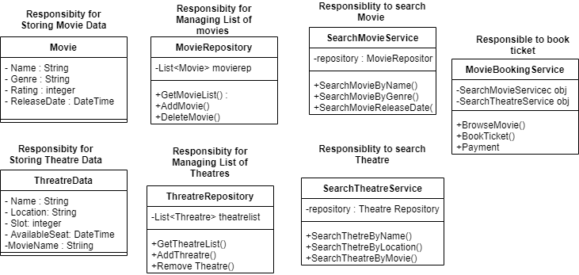
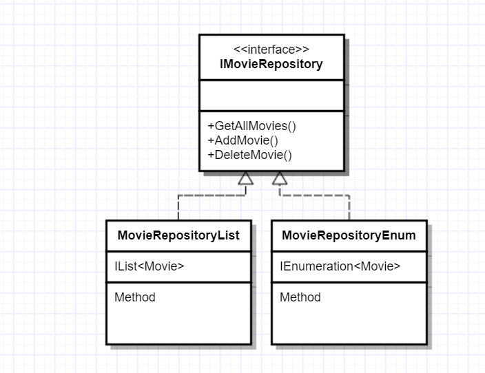

<h1>Dependency Inversion Principle</h1>

​		***Dependency Inversion*** principle states that " *Program for Interface not Implementation*".

Lets again take example of Movie Booking . Applying SRP principle we have identified roles and responsibility for each class as shown below: 

​	We can observe two classes "***MovieRepository***" and "***TheatreRepository***". These classes contains list of movies and theatre. They provide data to Search Service , Hence we can name them as "***Service Provider***".We have Search Services using these service , hence we can call them as "**Service Consumer**"

​	If we have to replace data structure of MovieRepository from List to Enumeration , then Service Consumer would be affected. This is called as ***tight coupling***.  With this tight coupling this would require more changes to be done , if we try to alter providers then consumer would be affected.

​	In order to remove this Tight Coupling , We can create an interface which exposes only required functionality and which is in-turn implemented by Provider classes. Hence changes in Provider classes will not affect Service Consumer. This is called ***Loose Coupling***. Hence DIP is refer has program to interface and separate it from implementation.

Please find MovieRepository interface below after applying DIP: 

